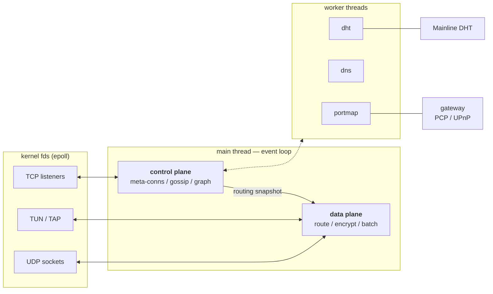
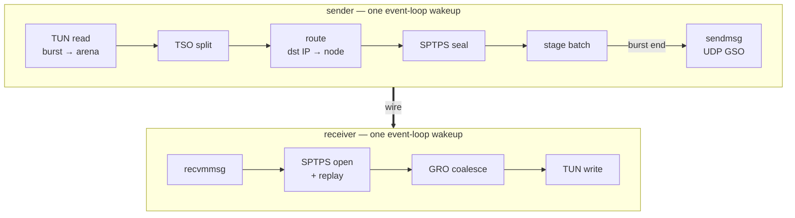

# Fitting tincr together

*TL;DR: a single-threaded reactor that treats the kernel as the
batching layer. Control plane and data plane share one thread but
borrow disjoint state; anything that has to block is exiled to a
worker. The wire protocol is tinc 1.1's, unchanged.*

Over the past while tincr has grown from "let's see if the SPTPS
handshake round-trips" into a daemon you can actually run a mesh on.
The individual pieces have landed one at a time and each commit
explains its own *why*, but we never wrote down how they're meant to
fit together. This document does that. If you've read the tinc 1.1
sources, think of this as: same protocol, different engine room.

For what actually goes over the wire, see [PROTOCOL.md](PROTOCOL.md).
For "I run C tinc today, what changes?", see [COMPAT.md](COMPAT.md).



Solid edges are fds the event loop polls; dashed is the non-blocking
request/result channel pair each worker shares with the control
plane. The data plane reads the control plane's state only through an
immutable routing snapshot, so a burst never contends with gossip.

## Design Goals

Before the *how*, the *what for*. These are the constraints everything
below is in service of:

1. **Wire compatibility with tinc 1.1.** A tincr node must be a
   drop-in mesh member. No flag days, no "upgrade everything at
   once". This pins the meta-protocol, the SPTPS handshake, and the
   UDP framing exactly; we get to change everything else.

2. **One thread on the hot path, and it never blocks.** Mesh VPN
   traffic is latency-sensitive and bursty. A packet that arrives
   while the forwarding thread is parked on a DNS lookup, a DHT
   query, or a lock is a packet that's late. We'd rather have one
   thread that is *always* runnable than four threads negotiating
   ownership of a socket.

3. **Let the kernel do the batching.** Modern Linux will hand a
   userspace VPN 64 KiB of TCP in one read and accept 64 KiB back in
   one write, and will turn one `sendmsg` into forty UDP datagrams on
   the wire. The daemon's job is to keep packets in those large
   aggregates for as long as possible and not get in the way. If
   we're doing more than a handful of syscalls per burst, that's a
   bug.

4. **Zero-config rendezvous.** A new node should be able to find the
   mesh with nothing but its invite — no `Address =` line pointing at
   a relay someone has to keep running on a static IP. This is the
   one place we add protocol surface, and it's deliberately
   out-of-band so C nodes don't need to know it exists.

5. **Degrade, don't fall over.** Hostile or broken input — a rogue
   gateway on the LAN, garbage on the UDP socket, a peer flooding
   `ADD_EDGE` — should cost at most a log line and a dropped packet,
   never unbounded memory or a stalled event loop.

With those on the table, let's walk through the pieces.

## One Thread, Two Planes

tincr is a single-threaded reactor. One thread owns the event loop,
every socket, the TUN device, and every timer. There is no async
runtime, no work-stealing scheduler, no `Arc<Mutex<…>>` around the
routing table. That's not asceticism; it's the cheapest way to
satisfy goal 2. With one owner there is nothing to lock, and "is the
forwarding path waiting on anything?" has a one-word answer.

The trade-off, of course, is that the one thread genuinely must not
block. Anything that *can't* be made non-blocking — and there are
exactly two such things today, DHT operations and NAT port-mapping
round-trips — is moved onto a small worker thread. Workers don't
share state with the main thread; they take a request over a channel,
go away for however long it takes, and post a result back. The main
thread polls the result channel without waiting. If a worker dies,
the feature it backs degrades; forwarding doesn't notice.

Inside the main thread, daemon state is split into two halves:

- The **control plane** maintains the picture of the mesh. It dials
  and accepts meta-connections, authenticates peers, and exchanges
  gossip — who exists, who is connected to whom, which IP ranges
  belong to whom. From that it keeps a graph of the whole mesh and,
  whenever the graph changes, recomputes a routing snapshot: for
  every known node, which neighbour is the next hop. It also runs the
  connection policy: keep a small random set of meta-connections for
  resilience, and opportunistically dial a direct one to anyone we
  find ourselves relaying heavy traffic for.

- The **data plane** moves packets. Read from TUN, look up the
  destination, encrypt for the owning node, send over UDP (directly
  if we can, via a relay if we can't). And the reverse: receive UDP,
  authenticate and decrypt, write to TUN. That's it.

The two halves live in one struct but are laid out so the borrow
checker can see they're disjoint. The data plane reads the routing
snapshot the control plane published — read-only, behind an `Arc` —
and otherwise touches none of the control plane's fields. So
"processing a gossip message" and "forwarding a packet" never contend,
not even in the type system, and the line between them is something
you can grep for rather than something you have to keep in your head.

## The Hot Path: Life of a Packet

This is where goal 3 earns its keep. If you `strace` a classic
per-packet VPN under an `iperf3` load, the trace is a wall of
`read`/`sendto` pairs, one per MTU-sized packet — easily 80 k
syscalls/s/Gbit and the CPU pinned in the kernel. Here's the same
load through tincr on Linux:

```
read(3, ..., 65559)                       = 61490   # TUN: one TSO super-frame
sendmsg(7, {msg_iov=[{..., 62216}],
            msg_control=[{cmsg_type=UDP_SEGMENT, ...}], ...}, 0) = 62216
read(3, ..., 65559)                       = -1 EAGAIN
recvmmsg(7, [...], 64, MSG_DONTWAIT, NULL) = 43     # UDP: one batch
write(3, ..., 61490)                      = 61490   # TUN: one GRO super-frame
```

Forty-odd packets in, forty-odd packets out, four syscalls. Let's
walk through how that happens.



A local application writes to the TUN interface. The event loop wakes
on the device fd and drains what's there into a pre-sized arena. On
Linux the kernel has been told the device supports TCP segmentation
offload, so what comes out of `read()` for a bulk TCP flow is one
super-frame up to 64 KiB — the kernel never bothered to chop it into
MSS-sized pieces, because we told it we'd handle that. We split it
ourselves, in place, into path-MTU-sized segments.

Each segment is routed: destination IP → owning node (a trie lookup)
→ next hop towards that node (a read from the routing snapshot). It's
encrypted for the destination node into a reusable scratch buffer,
gets a small relay-addressing prefix on the front, and is staged into
a contiguous batch buffer rather than sent right away.

When the burst ends — or the next segment is for a different
destination, or a different size — the staged run is shipped as a
single `sendmsg` with a `UDP_SEGMENT` control message. The kernel
fans it back out into individual datagrams below us. On platforms
without segmentation offload the same code falls back to a `sendto`
loop; correctness is identical, only the syscall count differs.

On the receiving side the event loop wakes on the UDP socket and
pulls up to 64 datagrams in one `recvmmsg`. Each is matched to its
tunnel by the prefix, AEAD-authenticated and decrypted into a receive
arena, and offered to a coalescer. Runs of in-order TCP segments for
the same flow are stitched back into one super-frame and written to
TUN in a single call with a synthesised offload header — symmetric
with what we read on the way in. Anything that doesn't coalesce
(UDP, out-of-order, different flow) is written through individually.

After the first packet at MTU all the buffers involved — the device
arena, the encrypt scratch, the batch buffer, the receive arena, the
coalescer — are at their final capacity and stay there. There are no
heap allocations on this path in steady state, and the syscall count
per burst is O(1) rather than O(packets).

## Finding Each Other

Forwarding over UDP is the goal, but it presupposes the two ends can
address each other. Behind consumer NAT and stateful firewalls they
generally can't, at least not at first. Three mechanisms close the
gap, in increasing order of independence:

- **Reflexive discovery.** Once *any* meta-connection exists, peers
  report the source address they observe on each other's packets, and
  UDP probes ratchet up a working path MTU. This is the tinc 1.1
  mechanism and it works well — provided you can make that first
  connection, i.e. at least one node has a known address.

- **Port mapping.** A worker thread asks the local gateway — PCP
  first, UPnP-IGD as fallback — to forward a TCP/UDP port (on IPv4)
  or open a firewall pinhole (on IPv6). When it works, the node has
  an address that accepts unsolicited inbound, and we publish it.
  When it doesn't, nothing else is affected.

- **DHT rendezvous.** This is the piece that delivers goal 4. The
  node publishes its current dialable address to the public
  BitTorrent DHT, encrypted under a key that only mesh members can
  derive, signed under a key that rotates daily so records can't be
  linked over time. A peer holding the right host file derives
  today's lookup key, fetches the record, decrypts it, and dials —
  without either side having a fixed address and without leaking mesh
  membership to anyone crawling the DHT. The DHT client lives on its
  own worker thread because a publish or lookup can take seconds, and
  per goal 2 those seconds must not be the forwarding thread's
  problem.

Until a UDP path is confirmed, traffic falls back to the
meta-connection's TCP stream or to a relay. As soon as it is, traffic
moves over.

## Threading Model

| Thread     | Owns                                                                                      |
| ---------- | ----------------------------------------------------------------------------------------- |
| main       | Event loop, all sockets, TUN device, all daemon state. Must not block.                    |
| dht-worker | The Mainline DHT client. Publish/resolve round-trips. Main thread enqueues, polls results.|
| portmap    | PCP and UPnP-IGD round-trips. Each exchange wall-clock-bounded.                           |

What about more than one core? On the current hot path, `perf`
puts ~53 % of cycles in the ChaCha20 keystream and the bench plateaus
around 5 Gbps. That's a good problem to have — it means the syscall
batching above did its job and the wall is now arithmetic, not I/O —
but it's still a wall, and one core of arithmetic is one core of
arithmetic.

The answer is sharding: N TUN queues, N reuseport UDP sockets, N
threads each running the exact data plane described above on its own
slice of peers, with the kernel steering each flow to a consistent
shard so nothing is shared per packet. We've deliberately laid the
groundwork for this already — multi-queue TUN open, a three-
instruction classic-BPF reuseport program (no `CAP_BPF` needed),
SPTPS sessions that hand out shareable seqno/replay state, and the
read-only routing snapshots the single-thread path already runs on.
What does *not* exist yet is the part that actually spawns a second
thread. So if you're looking for a `Shards = 4` knob today: there
isn't one. The pieces are arranged so that adding it is wiring, not
restructuring, and until someone needs more than ~5 Gbps through a
single node it hasn't been the most useful thing to finish.

There are two known places the main thread can still stall, both
inherited from the C design and both off the per-packet path: DNS
resolution when dialling a peer by hostname, and the synchronous
`tinc-up`/`tinc-down` scripts at start/stop. Per-event hooks
(`host-up`, `subnet-up`, …) are already fork-and-forget. We'd like to
move the remaining two off-thread as well; until then, a slow DNS
server can delay an outgoing reconnect — but not a forwarded packet.

## How the Crates Fit

For orientation, not memorisation:

| Crate         | Role                                                                       |
| ------------- | -------------------------------------------------------------------------- |
| `tinc-event`  | The reactor: epoll/kqueue, timers, signal handling.                        |
| `tinc-crypto` | The fixed primitive set: Ed25519, X25519, ChaCha20-Poly1305, SHAKE256.     |
| `tinc-sptps`  | Authenticated key exchange + record layer (see [PROTOCOL.md](PROTOCOL.md)).|
| `tinc-proto`  | Meta-protocol message catalogue, parse/format only.                        |
| `tinc-graph`  | Mesh graph and shortest-path routing.                                      |
| `tinc-conf`   | Config file parser.                                                        |
| `tinc-device` | TUN/TAP I/O and the kernel-offload helpers.                                |
| `tincd`       | The daemon: ties the above into the two planes.                            |
| `tincd-bpf`   | Kernel-side flow steering for the multi-queue mode.                        |
| `tinc-tools`  | `tinc` CLI and auxiliary binaries.                                         |
| `tinc-ffi`    | Test-only: builds the C SPTPS as a differential oracle.                    |

Deep-dive design notes live under [`docs/design/`](design/).
