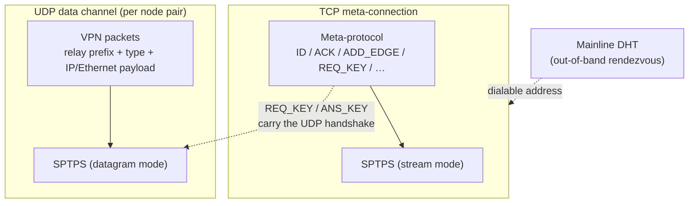
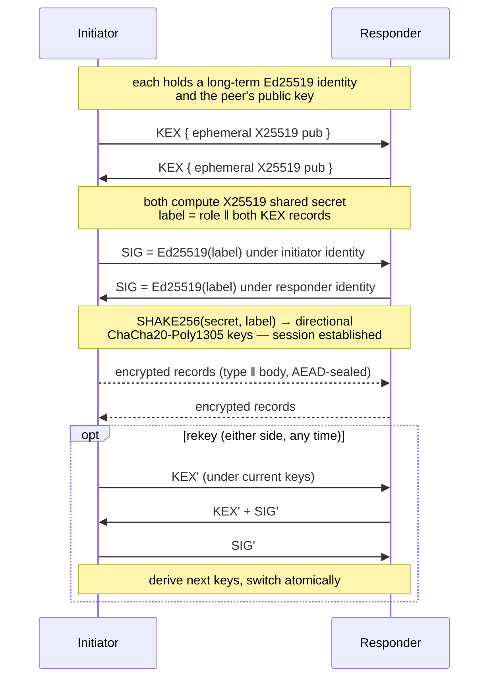
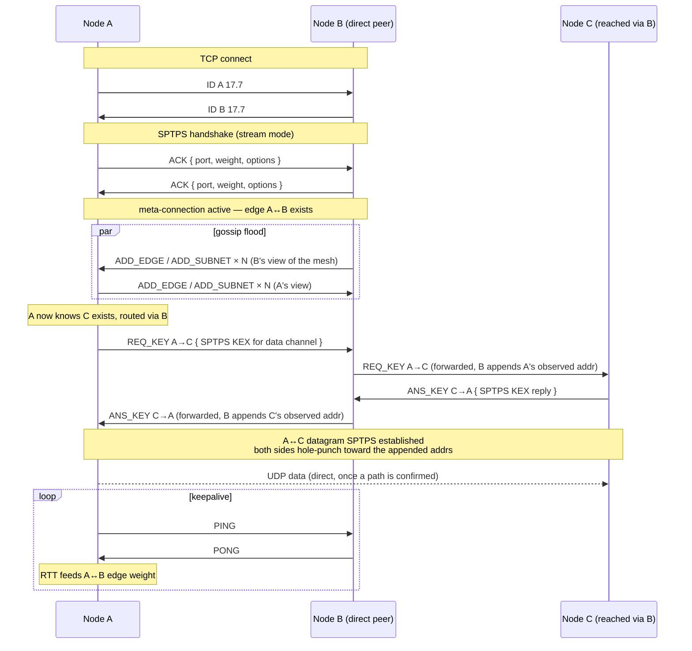
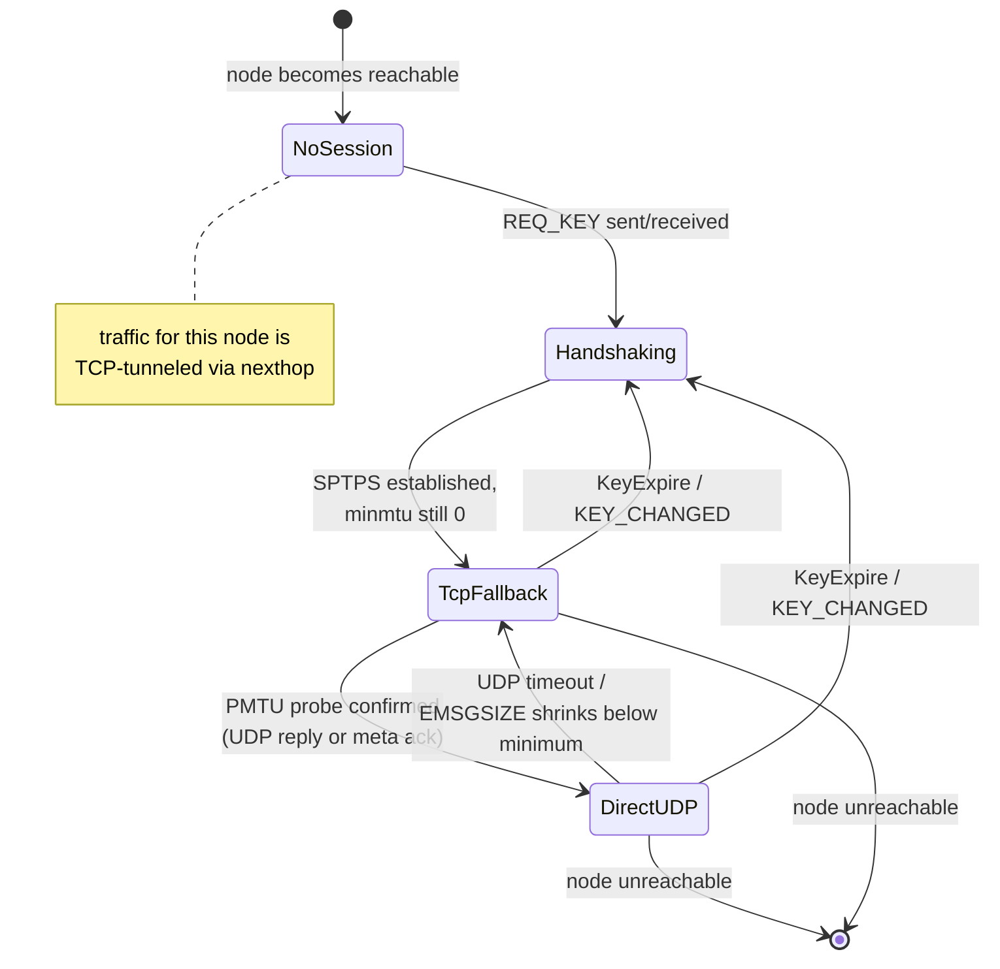

# The tincr wire protocol

*TL;DR: it's the tinc 1.1 protocol. SPTPS for the crypto, a
line-oriented ASCII control channel for gossip, a thin relay prefix
on UDP for data. tincr's additions are either trailing tokens that C
tinc already ignores, or fully out of band.*

If you've read `tinc-c/src/protocol*.c` this document won't teach you
a new protocol; it's here to put the layers in one place and to be
explicit about where tincr extends them and why that's safe. For the
interop matrix see [COMPAT.md](COMPAT.md).

## The Three Layers



1. **SPTPS** is the cryptographic transport: an authenticated key
   exchange and an AEAD record layer. It's used twice — once in
   stream mode over TCP to protect the meta-connection, and once in
   datagram mode over UDP per node pair to protect the actual VPN
   traffic.

2. The **meta-protocol** is a line-oriented ASCII control channel
   carried inside the TCP SPTPS session: identity, topology gossip,
   key relay, keepalive. This is where the mesh learns about itself.

3. **Data framing** is how encrypted VPN packets ride UDP: an SPTPS
   datagram with a short cleartext routing prefix in front, so a
   relay can forward without being able to decrypt.

A fourth piece, **DHT rendezvous**, sits entirely outside the mesh
protocol and is covered at the end.

## SPTPS

Each node has a long-term Ed25519 identity. The handshake is a signed
ephemeral X25519 exchange: both sides send an ephemeral public key,
both sign the transcript with their identity key, both derive a shared
secret and expand it with SHAKE256 into directional ChaCha20-Poly1305
keys. Either side may later trigger a rekey, which runs the same
exchange under the protection of the current keys and switches over
atomically.



Once established, SPTPS carries typed *records*. In **stream** mode
(the meta-connection) records are length-prefixed and delivered in
order — it's a TLS-shaped thing over an already-ordered byte stream.
In **datagram** mode (the UDP data channel) each record is
self-contained with an explicit sequence number; the receiver runs a
sliding replay window and tolerates loss and reordering. The sequence
number doubles as the AEAD nonce, so it never repeats under a key,
and a session rekeys well before it could wrap.

The cipher suite is fixed: Ed25519, X25519, ChaCha20-Poly1305,
SHAKE256. There is no negotiation, and the legacy RSA/CBC mode that
tinc 1.1 still carries for 1.0 compatibility is not implemented at
all. That's a deliberate reduction in attack surface — see
[COMPAT.md](COMPAT.md) for the operational consequences.

## Meta-protocol

Meta-connections are TCP. The first thing each side sends is a single
plaintext line — `ID name 17.7` — so the receiver can pick the right
host key before any crypto runs. Immediately after, the socket
switches to SPTPS stream mode and everything further is encrypted.

Inside, messages are newline-terminated, space-separated ASCII; the
first token is a numeric request code. The vocabulary:

| Message                     | Purpose                                                                          |
| --------------------------- | -------------------------------------------------------------------------------- |
| `ID`, `ACK`                 | Handshake: name, protocol version, listening port, options, initial edge weight. |
| `ADD_EDGE` / `DEL_EDGE`     | Gossip a meta-connection appearing or disappearing somewhere in the mesh, with its endpoint address and weight. Flooded. |
| `ADD_SUBNET` / `DEL_SUBNET` | Gossip which IP/MAC ranges a node owns. Flooded.                                 |
| `KEY_CHANGED`               | A node discarded its data-channel keys; everyone drops cached sessions for it.   |
| `REQ_KEY` / `ANS_KEY`       | Set up the per-pair UDP SPTPS session. Forwarded hop-by-hop along the routed path so two nodes can handshake without a direct connection; relays append the source address they observed, which both ends then use for NAT hole-punching. |
| `MTU_INFO` / `UDP_INFO`     | Share path-MTU ceilings and observed UDP endpoints along a relay path.           |
| `PING` / `PONG`             | Keepalive. The round-trip also feeds the advertised edge weight.                 |
| `PACKET`, `SPTPS_PACKET`    | Tunnel a data packet over this TCP stream when no UDP path is usable.            |



Why ASCII lines in 2026? Because that's what's deployed, and goal one
is interop. But the format has a property worth pointing out: parsing
is permissive, and extra trailing tokens on a line are ignored. That's
the entire extension mechanism. tincr uses it in three places —

- an extra "your UDP probe arrived" length on `MTU_INFO`, so a node
  whose inbound UDP is filtered can still learn its *outbound* UDP
  works;
- an extra reflexive address on `REQ_KEY` in the reverse direction,
  doubling the NAT-punch hit rate;
- re-advertising `ADD_EDGE` when measured RTT drifts, rather than
  pinning the weight at whatever the TCP handshake happened to
  measure;

— and a C tinc node parses the part it understands and ignores the
rest. No version negotiation, no capability bits, no flag day.

A separate `ID`-line form, with a hash in place of the name, drives
the invitation protocol: a fresh node connects with an invite cookie
instead of an identity, and the server provisions it with a name,
keys, and starter host files over the same SPTPS channel.

## Data framing

Once two nodes share a datagram-mode SPTPS session, VPN traffic flows
as UDP between them. Each datagram is:

```
dst_id6 ‖ src_id6 ‖ seqno ‖ type ‖ ciphertext ‖ tag
```

`dst_id6` and `src_id6` are 6-byte node identifiers (a hash of the
node name). They sit *outside* the encrypted portion so a relay can
read `dst_id6`, consult its own routing table, and forward the
datagram onward without holding any key material for it. Everything
from `seqno` onward is a standard SPTPS datagram record.

The record `type` byte says what the plaintext is: a raw IP packet
(router mode), a full Ethernet frame (switch/hub mode), the same but
compressed, or a PMTU probe. In router mode the Ethernet header is
stripped before encryption and synthesised again on the far side from
the IP version nibble — 14 bytes per packet that never hit the wire.

Direct UDP is always preferred. When it isn't available — path MTU
still unknown, UDP filtered, no address learned yet — the same
payload is wrapped as a meta-protocol `SPTPS_PACKET` and sent over
the TCP stream to the next hop instead. PMTU discovery runs in the
background, ratcheting probe sizes upward; as soon as a working size
is confirmed (by a UDP reply, or by a meta-protocol acknowledgement
when the reply direction is filtered), data moves to UDP.



## DHT rendezvous (out of band)

This part has no equivalent in C tinc. Its job is to remove the last
piece of static configuration: the `Address =` line pointing at a
relay someone has to keep on a fixed IP.

The mechanism is BEP 44 mutable items on the public BitTorrent
Mainline DHT — millions of nodes, no infrastructure of ours. The
problem with publishing to a public DHT, of course, is that it's
public: a crawler shouldn't be able to enumerate mesh members or
watch a node move between networks. So two layers of blinding:

1. **The lookup key** is the node's Ed25519 identity *blinded* with a
   factor derived from the mesh name, the public key, and the current
   day. Anyone holding the node's host file can derive today's key
   and verify the signature; anyone without it sees a fresh random
   key every 24 h, unlinkable to yesterday's and to the identity. The
   DHT storer can verify the record is signed by the key it's stored
   under — that's all BEP 44 requires — without learning whose
   identity that key belongs to.

2. **The value** — the actual address list — is encrypted with
   XChaCha20-Poly1305 under a key derived from the same inputs plus
   an optional mesh-wide secret. With no secret configured, holding
   any host file is enough to read records. With one configured,
   resolution is gated to nodes that also hold the secret, so a
   leaked host file alone is useless.

A peer that wants to find a node derives today's blinded key, fetches
the item, decrypts it, and dials. Neither side needed a fixed
address; nothing on the DHT links the record to the mesh; and a C
tinc node in the same mesh is simply unaware any of this happened —
it sees an inbound connection like any other.
